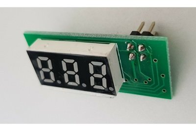
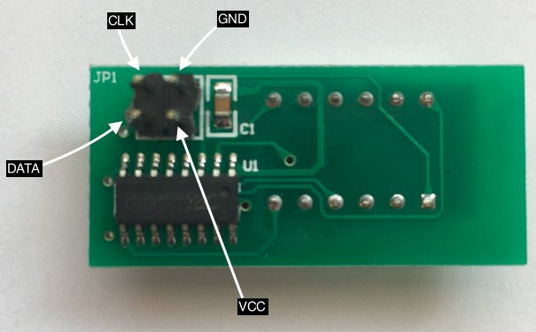
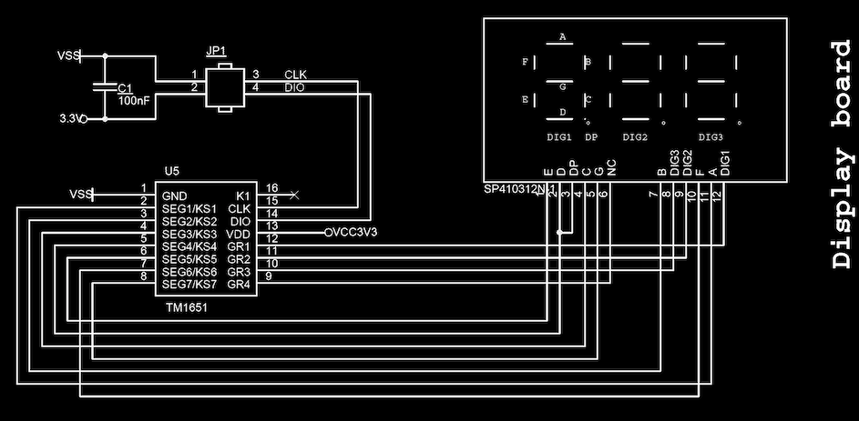
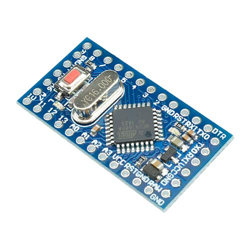
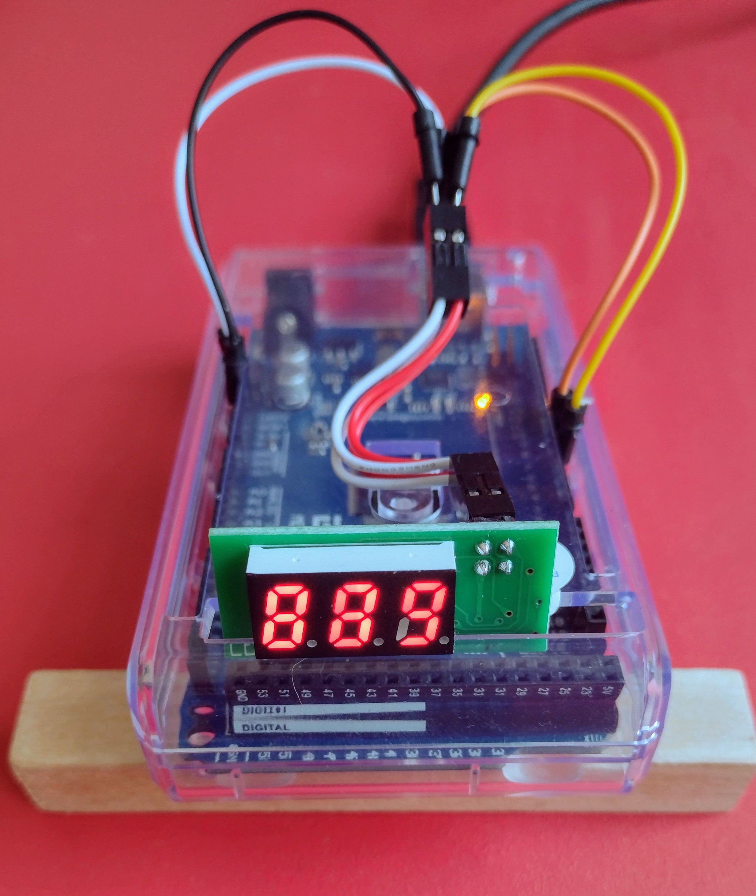

# [easiTM1651 Arduino Library](https://github.com/ilneill/easiTM1651)

This is a very simple Arduino Library to control the TM1651 (up to) 4 digit 7-segment LED display driver. 

The TM1651 is a small IC that can control up to four 7-segment LED display digits. It also has a keyboard scan interface, but that feature is not supported by this library. It uses a 2-wire serial interface that initially appears similar to the I2C bus, but it is not I2C and the protocol is very different.

## Why... Why Indeed?

Another project I am working on (A Kim-1 Mega Emulator) has a lot of rabbit holes that I am compelled to go down.

One such rabbit hole is trying and testing libraries and hardware for some keypad input and LED/LCD output. I am mostly testing on an Arduino Mini Pro (it was what I had to hand), but I am also using an Arduino Mega (it was beside the Mini Pro). After a lot of research, none of the existing TM1651 libraries were ticking all the boxes for what I wanted to achieve, and how I wanted to achieve it. So, I decided to write my own library for the TM1651, doing exactly what I wanted, how I wanted it to be done, keeping it simple and without any unnecessary "features".

## Contents

1. [Library Features](https://github.com/ilneill/easiTM1651/#library-features)
2. [Library Installation](https://github.com/ilneill/easiTM1651/#library-installation)
3. [API Details](https://github.com/ilneill/easiTM1651/#api-details)
4. [TM1651 Chip Pinout](https://github.com/ilneill/easiTM1651/#tm1651-chip-pinout)
5. [A Common TM1651 Module](https://github.com/ilneill/easiTM1651/#a-common-tm1651-module)
6. [Example Hardware Build](https://github.com/ilneill/easiTM1651/#example-hardware-build)
7. [ToDo](https://github.com/ilneill/easiTM1651/#todo)
8. [References](https://github.com/ilneill/easiTM1651/#references)

## Library Features

This library uses manual bit banging for the serial communication protocol and implements several higher functions built on one that simply write bytes to the TM1651 device.

* Supports LED 7-Segment displays of up to 4 digits using the TM1651.
* Supports the auto addressing and fixed addressing modes of the TM1651 chip.
* Has functions to easily display defined characters and 8, 12 and 16 bit numbers in decimal or hex digits.
* Supports the Gotek LEDC68 3-digit LED module, including its (poor) decimal point implementation.

## Library Installation

Currently the best (only) way you can install this library into your Arduino environment is manually from this repository.  

### Installing via this Repository 

First, you have to [download](https://github.com/ilneill/easiTM1651/archive/refs/heads/main.zip) this library in zip format. 

Then, unzip the easiTM1651-main.zip file into your Arduino Library folder. 

* On __Windows__: Documents\Arduino\libraries
* On __MAC OS__: ˜/Documents/Arduino/libraries
* On __Linux__: ˜/Documents/Arduino/libraries

## API Details

### Class definition:
__TM1651(uint8_t clkPin = 2, uint8_t dataPin = 3, bool LEDC68 = true);__
* Create a TM1651 instance.

### Functions:
__void begin(uint8_t numDigits = 3, uint8_t brightness = 2);__
* Set up the display and initialise it with starting values. Returns nothing.

__void begin(uint8_t* tmDigitMap, uint8_t numDigits = 3, uint8_t brightness = 2);__
* Compile time dependent. Set up the display and initialise it with starting values. Returns nothing.

__void displayOff(void);__
* Turn the TM1651 display OFF. Returns nothing.

__void displayClear(void);__
* Clear all the digits in the display. Returns nothing.

__void displayBrightness(uint8_t brightness = 2);__
* Set the brightness (0x00 - 0x07) and turn the TM1651 display ON. Returns nothing.

__void displayChar(uint8_t digit, uint8_t number, bool raw  = false);__
* Display a character in a specific LED digit. Returns nothing.

__void displayInt8(uint8_t digit, uint8_t number, bool useDec = true);__
* Display a decimal integer between 0 - 99, or a hex integer between 0x00 - 0xff, starting at a specific digit. Returns nothing.

__void displayInt12(uint8_t digit, uint16_t number, bool useDec = true);__
* Display a decimal integer between 0 - 999, or a hex integer between 0x000 - 0xfff, starting at a specific digit. Returns nothing.

__void displayInt16(uint8_t digit, uint16_t number, bool useDec = true);__
* Display a decimal integer between 0 - 9999, or a hex integer between 0x0000 - 0xffff, starting at a specific digit. Returns nothing.

__void displayDP(bool status = false);__
* Turn ON/OFF the decimal points. Returns nothing. Only works if it is an LEDC68 module.

### TM1651 Addressing Modes
The TM1651 uses addresses and enable lines (GRID1- GRID4) to uniquely identify and access each of the LED 7-Segment display digits.

* Logical digit 0 = Address 0x00
* Logical digit 1 = Address 0x01
* Logical digit 2 = Address 0x02
* Logical digit 3 = Address 0x03 (or the decimal point if it is an LEDC68 module).

The TM1651 chip supports 2 addressing modes and the mode that is used by the library is determined at compile time using a compiler definition in the "easiTM1651.h" file.

* if __USEADDRAUTOMODE__ is defined: Automatic address mode is used.
* if __USEADDRAUTOMODE__ is NOT defined: Fixed address mode is used.

__Automatic__
In this mode, the address to be used by the TM1651 for accessing the first digit is specified before the digit write, and is automatically incremented, after each digit write, to point to the next digit.

This is useful if the digits to be written to are in sequential order.

__Fixed__
In this mode, the address to be used by the TM1651 for accessing each digit must be specified, before each digit write, to point to the digit that is to be written to.

This is useful if the digits to be written to are not in increasing sequential order. If, for example, the logical addressing of the TM1651 based display does not match the phyical layout, than this mode should be used. This concept is explained more below.

### TM1651 Logical to Physical Address Mapping
As alluded to earlier, the TM1651 uses addresses for each LED 7-Segment display digit.

In this library I have assumed that the lefthand digit is logical digit 0, and the righthand digit is logical digit 3. However, it may be that the physical layout of the digits, left to right is not the same as the logical addressing.

For instance, if the physical layout is such that logical digit 0, addressed by 0x00, is the righthand digit, and logical digit 3, addressed by 0x03, is the lefthand digit, then, without some translation, this library will actually display everything backwards. 

i.e. Trying to display "h123" would actually look like "321h" on such a display.

It might be that the logical and physical layouts are not simply reversed. When writing the related and similar TM1637 library I discovered that my 6-digit TM1637 display had a reversed physical layout for each of the 3-digit blocks making up the 6 digits.

 /-  -  -  -  -  -\
 |0||1||2||3||4||5| Physical digit\
 \-  -  -  -  -  -/

Logical digit 0 = Address 0x00 -> Physical digit 2\
Logical digit 1 = Address 0x01 -> Physical digit 1\
Logical digit 2 = Address 0x02 -> Physical digit 0\
Logical digit 3 = Address 0x03 -> Physical digit 5\
Logical digit 4 = Address 0x04 -> Physical digit 4\
Logical digit 5 = Address 0x05 -> Physical digit 3

To overcome this absurdity, I created a logical to physical mapping array, called __tmDigitMap__ to describe the physical location of each logical digit.

In the TM1637 example above this __tmDigitMap__ array would be {2, 1, 0, 5, 4, 3}.

Without the logical to physical mapping array, trying to display "012345" would actually display "210543". Notice how the untranslated display of "012345" gives the logical to physical mapping array that corrects (translates) the display!

In the easiTM1651 library, the idea is exactly the same way, but there can only be a maximum of 4 digits in the array, as that is the maximum number of digits supported by the TM1651 chip.

For the reversed TM1651 example above __tmDigitMap__, the logical to physical mapping array that would correctly translate the display, is {3, 2, 1, 0}. 

As a consequence of the logical addressing not necessarily incrementing left to right with the physical digits, I had to introduce support for the TM1651 fixed address mode. This allows the address of each digit to be specified before it is written. Contrast this with automatic address mode where the address is only specified at the beginning and incremented automatically by the TM1651 after each digit write.

## TM1651 Chip Pinout

| DIP16 Package | 
|-------| 
| .png)| 

### Pin Descriptions of the TM1651 DIP16 Package

|Pin Label | Pin Number | Description |
|----------|--------------------|-------------|
|GND| 1| GND - ground |
|SEG1/KS1| 2| Output (segment 1) |
|SEG2/KS2| 3| Output (segment 2) |
|SEG3/KS3| 4| Output (segment 3) |
|SEG4/KS4| 5| Output (segment 4) |
|SEG5/KS5| 6| Output (segment 5) |
|SEG6/KS6| 7| Output (segment 6) |
|SEG7/KS7| 8| Output (segment 7) |
|GRID4| 9| Output (bit 4) |
|GRID3| 10| Output (bit 3) |
|GRID2| 11| Output (bit 2) |
|GRID1| 12| Output (bit 1) |
|VDD| 13| VCC - supply voltage |
|DIO| 14| Data input/output |
|CLK| 15| Clock input |
|K1| 16| VCC - supply voltage |

See the [datasheet](datasheets/TM1651_V1.1_EN.pdf) for more details.

## A Common TM1651 Module

The image below shows the relatively common Gotek (if you have upgaded your Gotek display and want to do something with it) TM1651 based 3-digit LED 7-segment module.

| | The Gotek LEDC68 Module | |
|-------|-------|-------|
| Front | | Rear |
|  | |  |
| | Circuit Diagram | |
| |  | |

## Example Hardware Build

Everything I have written has been tested using an Arduino Mega and an Arduino Mini Pro (ATmega168P) development board with an FT232 USB Serial adapter, and compiled using Arduino IDE v2.3.3.

This is the simple build I used while testing the [LEDC68demo.ino](examples/LEDC68demo/LEDC68demo.ino) example with an Arduino Mega.

## ToDo

Is there anything? Let me know if you find a problem or think of any improvements!

## References 

Other TM1651 Arduino libraries that I was inspired by:
 *    https://github.com/coopzone-dc/GotekLEDC68
 *    https://github.com/mworkfun/TM1650
 *    https://github.com/mworkfun/TM1651

The TM1651 Datasheet:
* [Titan Micro datasheet - TM1651](https://www.nxp.com/docs/en/data-sheet/TM1651_V1.1_EN.pdf)

*or*

* [Titan Micro datasheet - TM1651](http://aitendo3.sakura.ne.jp/aitendo_data/product_img/ic/LED-driver/TM1651_%20V1.2/TM1651_V1.1_EN.pdf)

A useful Internet tutorial:
* https://www.instructables.com/Re-use-LEDC86-Old-Gotek-Display/

And the **GOTO** Guide for Markdown Syntax:
* https://www.markdownguide.org/cheat-sheet/

*Enjoy!*

// EOF